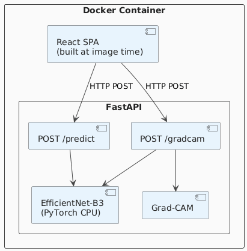

# Dermatological Analysis System

An AI-powered web application for skin condition classification, built for my Final Year Project. Users upload a photograph of a skin lesion or condition and then receive back the ranked list of the top five most likely conditions that the lesion matches. Each of those top 5 results are accompanied by a confidence score and a Grad-CAM heatmap that highlights the regions of the image the model factored in the most to reaching its final decision.

**Live demo:** https://huggingface.co/spaces/fosullyy/skin-analysis-app

> **Medical Disclaimer:** This tool is for educational and informational purposes only. It is NOT a substitute for professional medical advice, diagnosis, or treatment. Always seek the advice of a healthcare professional with any questions regarding a medical condition you may have. Never disregard professional medical advice or delay seeking it as a result of this tool's output.

---

## Features

- **24-class classification** - covers common skin conditions, i.e. conditions which were available in the datasets I identified. They range from acne and eczema to melanoma.
- **Top-5 predictions** - ranked by confidence score (evalulated through the softmax function in the neural network model used) with a bar chart that visualises the results.
- **Grad-CAM explainability** - visual heatmap overlay that shows the regions of the inputted image that drove each of the top 5 predictions the most. Also implemented client-side caching of heatmaps to prevent the backend having to re-calculate them upon switching back.
- **In-browser image preview** - generated client-side via FileReader before any data leaves the device.
- **Confidence score explainer** - UI explanation box of softmax probabilities for non-technical users.
- **Medical disclaimer** - prominently displayed on every page load. Matches the medical disclaimer I've put at the top of this README as well.
- **Collapsible conditions list** - all 24 detectable categories encased within a dropdown box, such that it's accessible without cluttering the main view.
- **Single-service deployment** - FastAPI serves both the REST API and the React SPA from one container.

---

## Architecture Diagram

Created using UML notation in [PlantText](https://www.planttext.com/).



---

## Tech Stack

| Layer | Technology |
|---|---|
| ML model | PyTorch, EfficientNet-B3 (torchvision) |
| Explainability | Grad-CAM |
| Backend | FastAPI (Python) |
| Frontend | React (JavaScript) |
| Containerisation | Docker (multi-stage build) |
| Deployment | Hugging Face Spaces (Docker, CPU basic - 2 vCPU / 16 GB RAM) |
| Model hosting | Hugging Face Hub |

---

## Model

The classifier is a fine-tuned **EfficientNet-B3** trained on  the Derm-24 dataset, my own dataset which is an aggregation of the [DermNet](https://www.kaggle.com/datasets/shubhamgoel27/dermnet/data) and [PAD-UFES-20](https://www.kaggle.com/datasets/mahdavi1202/skin-cancer/data) datasets, both sourced from Kaggle. The final classification head was replaced with a custom one that maps to 24 output classes, and the model was trained from ImageNet pre-trained weights, i.e. using transfer learning.

**Further training details** are contained in [`notebooks/model_efficientnet_b3_with_visualisations.ipynb`](notebooks/model_efficientnet_b3_with_visualisations.ipynb), the actual notebook that was used to train the model.

**Explainability implementation** is documented in [`notebooks/gradcam_explainability.ipynb`](notebooks/gradcam_explainability.ipynb), which was used to explore the implementation of Grad-CAM heatmaps, before I added them to the backend code. Because of this, the heatmap overlay logic is a little different between them, but the actual computation is the same.

### Detectable conditions

| | | |
|---|---|---|
| Acne and Rosacea | Actinic Keratosis / Basal Cell Carcinoma | Atopic Dermatitis |
| Bullous Disease | Cellulitis / Impetigo | Eczema |
| Exanthems / Drug Eruptions | Hair Loss / Alopecia | Herpes / HPV |
| Pigmentation Disorders | Lupus / Connective Tissue Disease | Melanoma / Nevi |
| Nail Fungus / Nail Disease | Contact Dermatitis | Psoriasis / Lichen Planus |
| Scabies / Lyme Disease | Seborrheic Keratoses | Squamous Cell Carcinoma |
| Systemic Disease | Tinea / Candidiasis / Fungal Infections | Urticaria (Hives) |
| Vascular Tumors | Vasculitis | Warts / Molluscum |

---

## API

The backend contains two endpoints:

### `POST /predict`

Accepts an image upload and returns the top-5 predicted conditions.

**Request**
```
Content-Type: multipart/form-data
Body: file=<image>
```

**Response**
```json
{
  "predictions": [
    { "class_name": "Eczema Photos", "confidence": 74.31 },
    { "class_name": "Atopic Dermatitis Photos", "confidence": 18.55 },
    ...
  ],
  "top_prediction": { "class_name": "Eczema Photos", "confidence": 74.31 }
}
```

### `POST /gradcam?class_index=<condition_index_integer>`

Accepts the same image upload and a target class index i.e. an integer representing the skin condition class that was selected for which a heatmap was to be produced. Returns base64-encoded PNG images of the Grad-CAM heatmap overlaid onto the original resized image.

**Response**
```json
{
  "heatmap": "<base64 PNG>",
  "original": "<base64 PNG>",
  "class_index": 5,
  "class_name": "Eczema Photos"
}
```

---

## Running locally

### Prerequisites

- Docker, or Python 3.11 + Node 18

### With Docker (ensure Docker is running)

```bash
docker build -t skin-analysis-app .
docker run -p 8000:8000 skin-analysis-app
```

Visit `http://localhost:8000`.

> **Note:** The Dockerfile downloads the model from Hugging Face at build time, which is quite large. Ensure you have a stable internet connection. Subsequent builds will reuse the cached Docker layer, so they shouldn't take as long.

### Without Docker

**Backend**
```bash
cd backend
pip install -r requirements.txt
# Place the model weights at models/aggregated_efficientnet_b3.pth
uvicorn main:app --host 0.0.0.0 --port 8000 --reload
```

**Frontend** (separate terminal)
```bash
cd frontend
npm install
npm start
```

---

## Deployment

The application is deployed as a Hugging Face space at [this link](https://huggingface.co/spaces/fosullyy/skin-analysis-app) using the Docker SDK on a free CPU basic instance (2 vCPU, 16 GB RAM). I previously tried deploying it on Render, but its free tier doesn't provide the necessary RAM to infer the results in a quick amount of time, and it also wasn't able to run Grad-CAM, which retains layer activations during the backward pass and peaks significantly higher than inference-only memory usage.

**Build process:**
1. Node builder stage compiles the React app with `npm run build`.
2. Python 3.11 slim stage installs dependencies, copies the compiled frontend, and downloads the model weights from the repo that holds them on [Hugging Face Hub](https://huggingface.co/fosullyy/skin-analysis-efficient-net-b3) at image build time.
3. Uvicorn starts and FastAPI serves both the API and the SPA from port 8000.

---

## Project Structure

```
.
├── backend/
│   ├── main.py
│   └── requirements.txt
├── frontend/
│   ├── src/
│   │   ├── App.js
│   │   └── App.css
│   ├── .env.production
│   └── package.json
├── notebooks/
│   ├── model_efficientnet_b3_with_visualisations.ipynb
│   └── gradcam_explainability.ipynb
├── models/
│   └── .gitkeep
└── Dockerfile
```

---

## Acknowledgements

- Datasets: [DermNet](https://www.kaggle.com/datasets/shubhamgoel27/dermnet/data), [PAD-UFES-20](https://www.kaggle.com/datasets/mahdavi1202/skin-cancer/data)
- Explainability: [pytorch-grad-cam](https://github.com/jacobgil/pytorch-grad-cam) by Jacob Gildenblat
- Base model: EfficientNet-B3 pre-trained on ImageNet via torchvision
